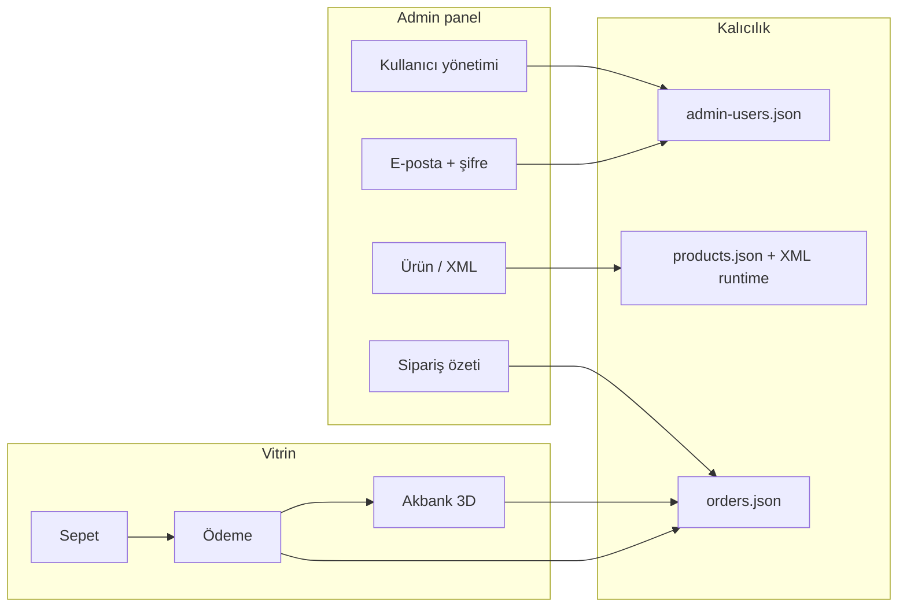

# Kalıcılık ve kullanıcı yönetimi haritası

Son durum (Ağustos 2026): panel tek `ADMIN_PASSWORD` ile giriyor; sipariş/ürün/analitik çoğunlukla dosya tabanlı.

## Mevcut depolar

| Veri | Konum | Agent notu |
|------|--------|------------|
| Manuel ürünler | `assets/data/products.json` | Git’e yazılabilir katalog |
| Tedarikçi XML cache/override | `.runtime/*-cache.json`, `*-overrides.json` | Sunucu yerel |
| Siparişler | `.runtime/orders.json` | Ödeme callback ile güncellenir |
| Analitik | `.runtime/analytics.json` | Günlük olay özeti |
| İletişim lead | `.runtime/contact-leads.json` | Form kayıtları |
| Takvim | `.runtime/calendar.json` | Hatırlatıcı / not |
| Admin kullanıcılar | `.runtime/admin-users.json` | **Yeni** — isim, soyisim, e-posta, hash şifre |
| Oturum | bellek (`Map`) | Restart’ta düşer |

## Hedef akış (uçtan uca)

## Fazlar

1. **Panel kullanıcıları (şimdi):** e-posta + şifre girişi, CRUD, `ADMIN_PASSWORD` ile ilk owner seed.
2. **Sipariş yüzeyi:** panelde sipariş listesi / durum (mevcut `orders.json` üzerine).
3. **İsteğe bağlı DB:** PostgreSQL/SQLite — aynı şema; dosya store arkasında adapter. Canlıda `.runtime` yedeklenmeden migrate edilmez.

## Müşteri hesabı (ayrı)

Mağaza müşteri hesabı (üye girişi) şu an yok; checkout misafir bilgisi siparişe yazılır. Üye sistemi ayrı fazdır; panel kullanıcıları ile karıştırılmaz.
