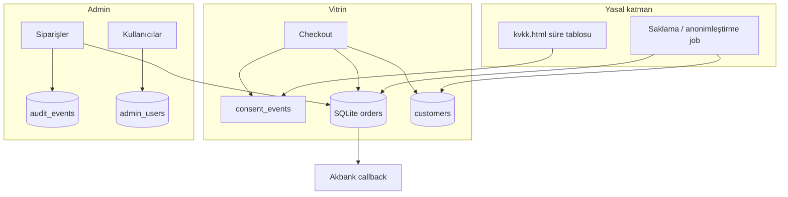

# Plan: Ticaret DB · Sipariş paneli · TR yasal uygunluk

**Durum:** Orchestrator kararı — 3 Ağu 2026  
**Hedef:** Sipariş/müşteri/onay verilerini veritabanına almak; panelden yönetmek; KVKK + mesafeli satış + VUK/TTK saklama mantığını sisteme bağlamak.

> Bu belge hukuki danışmanlık değildir. Metinler ve saklama süreleri şirket avukatı / mali müşavir ile doğrulanmalıdır. Sistem, politikalarda yazılanları teknik olarak uygular.

---

## 1) Mevcut durum (kısa)

| Alan | Bugün | Boşluk |
|------|--------|--------|
| Sipariş | `.runtime/orders.json` (max 500, eskiler silinir) | VUK/TTK ile çelişir; panel yok |
| Müşteri | Sipariş içinde misafir alanları | Ayrı entity yok; adres yok |
| Onay | Mesafeli/ön bilgi/iade bayrakları | Checkout’ta KVKK onayı yok; contact onayı kaydedilmiyor |
| Admin | KPI özeti | Liste/detay/fulfillment yok |
| Denetim | Yok | Admin işlem logu yok |
| DB | Yok (JSON) | Yedek/migrate zayıf |

---

## 2) Hedef mimari

**Motor:** SQLite (`.runtime/patygo.sqlite`) — tek VM deploy’a uygun; Postgres adapter sonra eklenebilir.  
**Geçiş:** JSON → SQLite migrate (bir kez, yedek alarak). Dual-read kısa süre; yazmalar SQLite’a.

---

## 3) Yasal / uyum gereksinimleri (sistem karşılığı)

| Kaynak | Gereksinim | Sistem karşılığı |
|--------|-----------|------------------|
| KVKK m.5–11 | Aydınlatma, amaç, saklama, silme/anonim, başvuru | Süre tablosu (politika + config); `consent_events`; anonimleştirme API; başvuru e-posta kanalı (mevcut info@) |
| TKHK / mesafeli | Sözleşme onayları, ön bilgilendirme | Checkout checkbox’lar + `contracts_accepted` + consent kaydı |
| VUK / TTK | Ticari/fatura kayıtları uzun süre | Ödenen siparişler **hard-delete edilmez**; yasal hold + anonim PII |
| Kart verisi | PAN/CVV saklanmaz | Değişmez (Akbank hosting) |
| İletişim | Açık rıza kanıtı | Lead + `consent_events` |

**Önerilen saklama (config; avukat teyidi sonrası sabitlenir):**

| Veri | Süre | Süre sonunda |
|------|------|-------------|
| Ödenen sipariş + fatura kimliği | 10 yıl (VUK odaklı varsayılan) | PII anonim; tutar/kalem kalır |
| Ödenmemiş / başarısız sipariş | 2 yıl | Sil veya anonim |
| İletişim lead (pazarlama değil, talep) | 2 yıl | Sil |
| Analytics | 90 gün (mevcut) | Sil |
| Audit (admin) | 5 yıl | Sil |
| Consent kanıtı | İlişkili kayıtla aynı | Birlikte |

---

## 4) Fazlar ve agent paslaşması

### Faz 0 — Orchestrator (şimdi)
- Plan + görev listesi
- Sıra: Backend şema → FE panel → SEO metin → QA → Release  

### Faz 1 — Temel DB + Sipariş paneli + KVKK kanıtı *(bu sprint)*

| # | Agent | Ne | Dosyalar | Doğrulama |
|---|--------|-----|----------|----------|
| 1.1 | Backend | SQLite şema, migrate orders/admin_users, dual-write | `lib/db.js`, `lib/orders.js`, `package.json` | unit test |
| 1.2 | Backend | `GET/PATCH /api/admin/orders`, audit append | `server.js`, `lib/audit.js` | API test |
| 1.3 | Backend | `consent_events` checkout+contact | `server.js`, `lib/consent.js` | test |
| 1.4 | Frontend | Admin **Siparişler** sekmesi (liste/detay/durum) | `admin.html`, `admin.js`, `admin.css` | admin-ui test |
| 1.5 | Frontend | Checkout KVKK checkbox + adres alanları (fatura/teslimat) | `odeme.html`, `checkout.js` | checkout test |
| 1.6 | SEO | `kvkk.html` sayısal saklama tablosu; gizlilik uyumu | `kvkk.html`, `gizlilik.html` | legal-pages test |
| 1.7 | QA | `npm test` + regression | `tests/*` | 119+ yeşil |
| 1.8 | Release | commit/push/CI | — | Actions yeşil |

### Faz 2 — Operasyon & haklar *(uygulandı — 5 Eyl 2026)*
- [x] Sipariş durumları: preparing / shipped / cancelled / refunded (+ refunded mail şablonu)
- [x] Panelden lead listesi (`GET /api/admin/leads`, Talepler sekmesi)
- [x] DSAR: admin “Anonimleştir” (`POST /api/admin/orders/:id/anonymize`, audit; legal_hold hard-delete engeli)
- [x] Otomatik retention cron (gece job, taslak süreler: 10y ödenen / 2y ödenmeyen / 2y lead) — `lib/retention.js`
- [x] Minimal `GET /api/admin/customers` listesi
- Müşteri birleştirme: e-posta ile upsert (mevcut); ayrı merge UI yok  

### Faz 3 — Sertleştirme
- Postgres adapter (opsiyonel)  
- Yedekleme scripti + restore denemesi  
- e-fatura alanları (harici entegrasyon hazırlığı)  
- Mağaza üye hesabı (ayrı ürün kararı)  

---

## 5) SQLite şema (özet)

`admin_users`, `customers`, `orders`, `order_items`, `consent_events`, `audit_events`  
— ayrıntılı alanlar: exploration notu + `lib/db.js` migrasyonları.

---

## 6) Bitiş kriteri (Faz 1)

1. Yeni siparişler SQLite’ta  
2. Panelde sipariş listesi + detay + durum güncelleme  
3. Checkout’ta KVKK onayı kaydı  
4. KVKK sayfasında süre tablosu  
5. Ödenen siparişler 500-cap ile silinmiyor  
6. `npm test` yeşil + CI deploy  

---

## 7) Riskler

- Deploy VM’de `better-sqlite3` native build → CI/VM’de build tools gerekir  
- Eski JSON migrate sırasında yedek zorunlu  
- Saklama süreleri avukat onayı olmadan “taslak / önerilen” etiketiyle yayınlanır  
